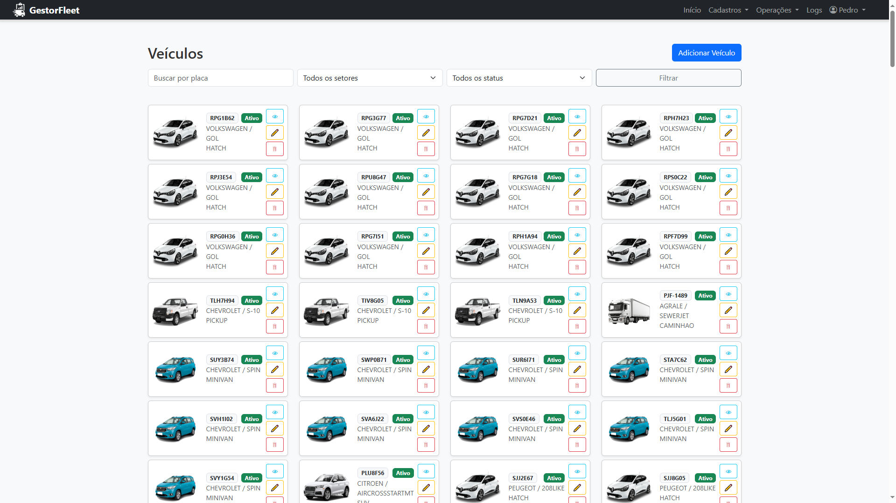

# 🚗 Sistema de Gestão de Frotas - Prefeitura de Lauro de Freitas/BA

## 🎯 Objetivo do Sistema
Desenvolver um sistema web para a **gestão eficiente da frota de veículos** da Prefeitura de Lauro de Freitas, permitindo:
- Controle de veículos e motoristas
- Registro e acompanhamento de multas
- Solicitação e liberação de pedágios
- Emissão de documentos oficiais em PDF
- Geração de relatórios e consultas detalhadas
- Auditoria completa das ações realizadas

---

## 🌐 Acesso ao Sistema
🔗 **Ambiente de Teste:** [https://gestorfleet.com/controle/](https://gestorfleet.com/controle/)

---

## 🧩 Módulos Principais

### 🚘 Cadastro de Veículos

- **Campos obrigatórios:** placa, RENAVAM, chassi, marca, modelo, tipo de frota, tipo de combustível  
- **Upload de documentos obrigatórios:** CRLV, seguro  
- **Classificação do modelo:** hatch, sedan, SUV, moto, ônibus, caminhão etc.  
- **Relacionamento com setores (Secretarias)**  
- **Histórico de motoristas vinculados**  
- **Controle de status:** ativo, inativo, manutenção, vendido  
- **Auditoria de criação e modificações** (via `django-simple-history`)  

---

### 👨‍✈️ Cadastro de Motoristas
- **Dados pessoais:** nome, CPF, RG, telefone, data de nascimento  
- **CNH:** número, validade, categoria (A, B, C, D, E, etc.)  
- **Upload da CNH digitalizada**  
- **Status:** ativo ou inativo  
- **Relacionamento com veículos**  

---

### 🔗 Vinculação Veículo ↔ Motorista
- Associação de motoristas a veículos (**muitos para muitos**)  
- Geração automática de **Termo de Responsabilidade em PDF**  
- Registro de histórico de vínculos  

---

### 🛠️ Manutenção de Veículos
- Registro de revisões ou manutenções realizadas  
- Quilometragem na manutenção  
- Tipo de manutenção: troca de óleo, pneus, etc.  
- Observações gerais  

---

### 🚨 Gestão de Multas
- Registro detalhado de infrações (**placa, local, órgão, valor, pontos**)  
- Relacionamento com motorista (opcional)  
- **Upload de documentos:** auto de infração, notificação, comprovante, memorando  
- **Status da multa:** enviado / recebido  
- **Status de pagamento:** pendente / pago  
- Integração com **tipos de infrações (InfracaoTransito)**  
- **Validações automáticas:** impede salvar multa como recebida/paga sem documentos  

---

### 🧾 Emissão de Documentos
- Termo de responsabilidade (motorista ↔ veículo)  
- Notificação de multa  
- Memorando da multa  
- **Todos os documentos são gerados e armazenados em PDF**  

---

### 📂 Auditoria e Histórico
- Histórico de alterações para todos os registros principais (motorista, veículo, multa, termo)  
- Rastreabilidade de quem criou/modificou (usuário responsável)  

---

## 🗄️ Modelo de Dados (Simplificado)
- **Veiculos**
- **Motoristas**
- **Vinculos** (Motorista ↔ Veículo)
- **Multas**
- **Documentos**
- **Manutencoes**
- **Pedagios**
- **Usuarios**
- **Termos** (PDFs gerados)

---

## 📌 Funcionalidades Técnicas
- Interface web responsiva  
- Autenticação e permissões por perfil de usuário  
- Upload e download de arquivos (PDF, imagens, DOC)  
- Geração automatizada de PDFs  
- Backup automático dos dados  
- Auditoria de ações (quem fez o quê e quando)  

---

## 🛠️ Tecnologias Utilizadas
- **Backend:** Django (Python)  
- **Banco de Dados:** PostgreSQL  
- **Servidor de Aplicação:** Gunicorn  
- **Servidor Web:** Nginx  
- **Frontend:** HTML5, CSS3, JavaScript (Bootstrap/React opcional)  
- **Relatórios/PDFs:** ReportLab / WeasyPrint  
- **Controle de Versão:** Git + GitHub  

---

## 🔒 Segurança
- **Fail2Ban** configurado para proteção contra ataques de força bruta  
- **HTTPS** habilitado com **Certbot (Let's Encrypt)**  
- **Controle de permissões** por perfil de usuário  
- **Auditoria de ações** para rastreabilidade  

---

### Pré-requisitos
- Python 3.10+  
- Django 4.x  
- PostgreSQL  
- Git  

